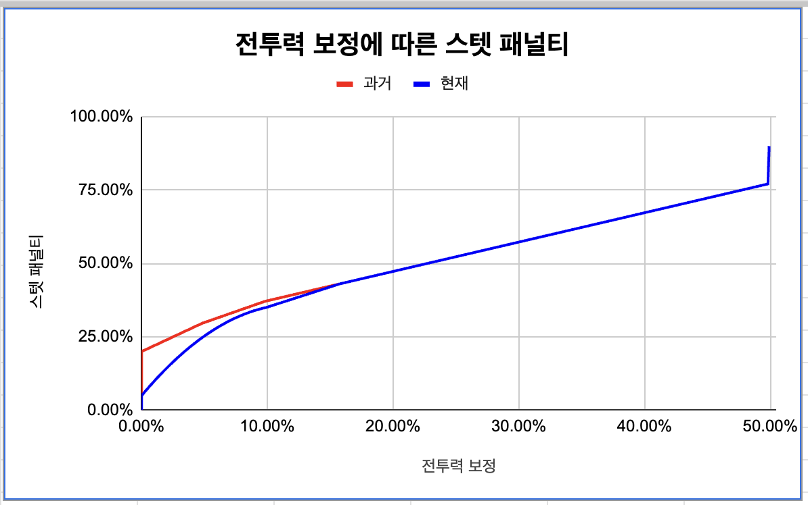
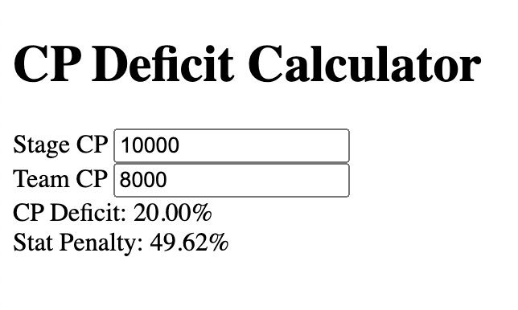

## Nikke: Goddess of Victory Deficit Calculator

This is a web-based calculator designed to help players of Nikke: Goddess of Victory determine the CP (Combat Power) deficit between their Stage CP (recommended CP for a stage) and Team CP (their actual team's CP). The CP deficit is a crucial factor in Nikke, as it can significantly impact battle outcomes.

**Features:**

- **Simple Interface:** Enter your Stage CP and Team CP values, and the calculator instantly displays the CP deficit percentage.
- **Conditional Formatting:** The background color of the stat penalty output dynamically changes based on the severity of the deficit (red for high deficit, orange for moderate deficit, yellow for minor deficit, green for no deficit).
- **Data-Driven:** The stat penalty calculation is based on a power law formula derived from data analysis (source: [https://www.reddit.com/r/NikkeMobile/comments/yur3la/nikke_resource_sheets/](https://www.reddit.com/r/NikkeMobile/comments/yur3la/nikke_resource_sheets/)).

**How to Use:**

1. Clone this repository or download the ZIP file.
2. Open the `index.html` file in your web browser.
3. Enter the Stage CP and Team CP values in the respective input fields.
4. The CP deficit percentage and stat penalty will be displayed automatically.

**Data Source and References:**

- **Nikke.gg**: [https://nikke.gg/](https://nikke.gg/) (general Nikke information)
- **Nikke Reddit**: [https://www.reddit.com/r/NikkeMobile/comments/yur3la/nikke_resource_sheets/](https://www.reddit.com/r/NikkeMobile/comments/yur3la/nikke_resource_sheets/)
- **Nikke Google Sheet**: [https://docs.google.com/spreadsheets/d/1PaPU07AAZvECsSQeOhzMxue3q-sYXiKWclT3geaDJAM/edit#gid=1167646947] (source of power law training data)

**Explanation of Stat Penalty Calculation:**

The CP deficit calculator utilizes a data-driven approach to determine the stat penalty based on the calculated CP deficit.

A separate Python script (not included in this repository) is responsible for learning the optimal formula to represent the relationship between CP deficit and stat penalty. This script (e.g., `learn_stat_penalty_formula.py`) analyzes a dataset containing CP deficit and corresponding stat penalty values. It then attempts to fit different mathematical functions (linear, exponential, power law) to the data and selects the one that best minimizes the error between the predicted and actual stat penalty values.

**Benefits:**

This data-driven approach ensures the stat penalty calculation is grounded in actual game data rather than relying on arbitrary assumptions. It allows for future adjustments if the underlying relationship between CP deficit and stat penalty changes in future game updates.

**Additional Notes:**

The specific formula used for the stat penalty calculation is not explicitly shown here, but it's determined by the `learn_stat_penalty_formula.py` script based on the analyzed data. You can consider mentioning the source of the data used for the formula if it comes from a reputable community resource.

  

**Disclaimer:**

The provided power law formula and stat penalty calculations are based on community-driven data analysis and may not be entirely accurate. It's recommended to use this calculator as a guideline and adjust your team composition based on your in-game experience.

**Contributing:**

If you'd like to contribute to this project, feel free to fork the repository and submit pull requests with improvements or additional features.

**License:**

This project is licensed under the MIT License.  See the `LICENSE` file for details.

