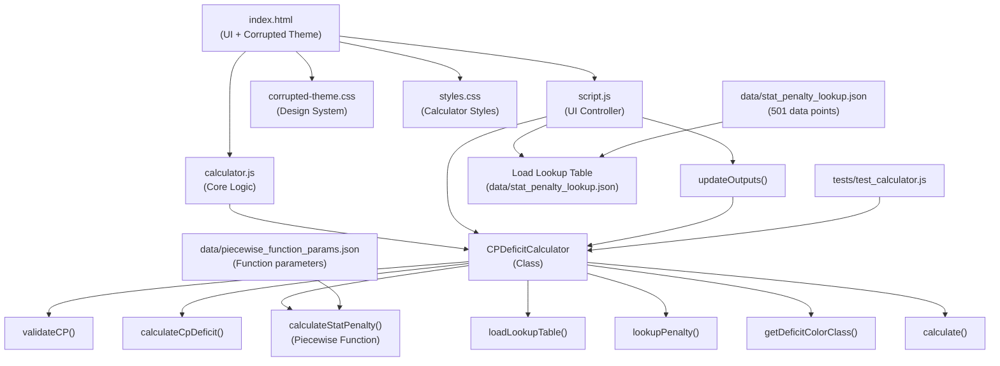
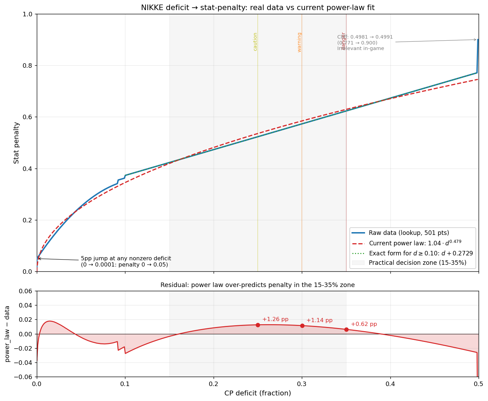

# NIKKE CP Deficit Calculator

**Self-contained calculator for determining Combat Power (CP) deficit and stat penalties in Goddess of Victory: NIKKE**

[](https://github.com/whykusanagi/nikke_deficit_calculator)
[](LICENSE)

<div align="center" style="margin: 2rem 0;">
<p align="center"></p>
</div>

## Overview

A production-ready, **self-contained** web-based calculator that helps NIKKE players determine the CP deficit between their Stage CP (recommended CP for a stage) and Team CP (actual team CP). The calculator uses a **piecewise function** with lookup tables and power law formulas derived from an included dataset (501 data points) for maximum accuracy.

## Features

- **Accurate Calculations**: Piecewise function with lookup table for low/high ranges, power law for main range
- **Beautiful UI**: Integrated with [corrupted-theme](https://github.com/whykusanagi/corrupted-theme) glassmorphic design system
- **Data-Driven Formula**: 501 data points included in repository (R² = 0.995062)
- **Self-Contained**: All data files included, no external dependencies
- **Input Validation**: Validates inputs and provides clear error messages
- **Visual Feedback**: Color-coded stat penalty display with smooth animations
- **Real-Time Updates**: Calculations update automatically as you type
- **Modular Architecture**: Core logic separated into reusable JavaScript class
- **Error Handling**: Graceful error handling for edge cases and network failures
- **Responsive Design**: Mobile-friendly, works on all screen sizes
- **Production Ready**: Optimized for deployment on nikkers.gg

## Architecture


```mermaid
graph TD
    A["index.html<br/>(UI + Corrupted Theme)"] --> B["calculator.js<br/>(Core Logic)"]
    A --> C["script.js<br/>(UI Controller)"]
    A --> D["corrupted-theme.css<br/>(Design System)"]
    A --> E["styles.css<br/>(Calculator Styles)"]
    
    B --> F["CPDeficitCalculator<br/>(Class)"]
    F --> G["validateCP()"]
    F --> H["calculateCpDeficit()"]
    F --> I["calculateStatPenalty()<br/>(Piecewise Function)"]
    F --> J["loadLookupTable()"]
    F --> K["lookupPenalty()"]
    F --> L["getDeficitColorClass()"]
    F --> M["calculate()"]
    
    C --> F
    C --> N["updateOutputs()"]
    N --> F
    C --> O["Load Lookup Table<br/>(data/stat_penalty_lookup.json)"]
    
    P["data/stat_penalty_lookup.json<br/>(501 data points)"] --> O
    Q["data/piecewise_function_params.json<br/>(Function parameters)"] --> I
    
    R["tests/test_calculator.js"] --> F
```

### File Structure

```
nikke_deficit_calculator/
├── index.html                          # Main HTML (corrupted-theme integrated)
├── calculator.js                        # Core CPDeficitCalculator class (piecewise function)
├── script.js                            # UI controller + lookup table loader
├── styles.css                           # Calculator-specific styles (extends corrupted-theme)
├── data/
│   ├── stat_penalty_data.csv           # Full dataset (501 points)
│   ├── cp_deficit_stat_penalty_data.csv # Percentage format
│   ├── stat_penalty_lookup.json        # Lookup table for piecewise function
│   ├── piecewise_function_params.json  # Function parameters
│   ├── model_fitting_results.json      # Model comparison results
│   └── README.md                       # Dataset documentation
├── scripts/
│   ├── extract_image_data.py           # Extract from stat_penalty.png (optional)
│   ├── enumerate_sheet_tabs.py          # Enumerate Google Sheets tabs (legacy)
│   └── extract_sheet_data.py           # Extract from deprecated sheet (legacy)
├── learn_stat_penalty_modernized.py    # Model fitting script
├── fit_model.py                        # Original model fitting script (legacy)
├── tests/
│   └── test_calculator.js              # Unit tests
├── DEPLOYMENT.md                       # Deployment guide
├── PRODUCTION_CHECKLIST.md             # Pre-deployment checklist
├── IMPLEMENTATION_SUMMARY.md           # Implementation overview
└── README.md                           # This file
```

### Component Responsibilities

- **CPDeficitCalculator Class**:
  - Input validation (`validateCP()`)
  - CP deficit calculation (`calculateCpDeficit()`)
  - Stat penalty calculation (`calculateStatPenalty()`) - Piecewise function
  - Lookup table management (`loadLookupTable()`, `lookupPenalty()`)
  - Color coding (`getDeficitColorClass()`)
  - Complete workflow (`calculate()`)

- **UI Controller**:
  - DOM event handling
  - Input/output updates
  - Error display management
  - Lookup table loading

## Quick Start

### Usage

1. **Clone or download** this repository:
   ```bash
   git clone https://github.com/whykusanagi/nikke_deficit_calculator.git
   cd nikke_deficit_calculator
   ```

2. **Open `index.html`** in any web browser
   - No build step required
   - Works offline after initial load
   - All data files included in repository

3. **Enter values**:
   - Stage CP: Recommended CP for the stage
   - Team CP: Your actual team's CP

4. **View results**:
   - CP Deficit: Percentage difference
   - Stat Penalty: Calculated penalty with color coding

The calculator automatically loads the lookup table for accurate calculations. If the lookup table fails to load, it falls back to the power law formula.

## How It Works

### CP Deficit Calculation

```
CP Deficit = max(0, Stage CP - Team CP) / Stage CP
```

### Stat Penalty Formula

The calculator ships with **two algorithms**. By default it uses interpolated lookup against the 501-point dataset; a power-law fit is kept as an opt-in for comparison.

#### Default: lookup with linear interpolation

For any deficit `d`, bisect into the sorted 501-point dataset and linearly interpolate between the two neighboring entries. Below the first nonzero data point (0.0001), returns the first entry's penalty (5%) — honors the game's "any nonzero deficit triggers a 5pp jump" mechanic. Above the last entry, clamps.

**Why default:** the underlying function is two clean regimes — a curved ramp from 0 to ~10% deficit, then a perfectly straight line (`penalty = deficit + 0.2729`, slope 1.0, zero deviation across 250 sampled points) from 10% onward. Interpolating directly on the dataset is exact; no model error.

#### Opt-in: power-law fit

```
Stat Penalty = 1.04 × deficit^0.479
```

R² = 0.9951 against the 1%–48% subset. Activate with `?algo=power_law` in the URL. The result panel displays an `algorithm: power_law` badge so screenshots and shared links are self-identifying.

This mode is preserved for comparison and historical purposes. It systematically over-predicts penalty by 1–2pp in the 15–35% decision zone.

#### Comparing the two



The blue curve is the raw data; the red dashed curve is the power law. The residual panel shows the over-prediction in the practical decision zone.

**Dataset**: 501 points covering 0% to 49.91% CP deficit. Data files: `data/stat_penalty_data.csv`, `data/stat_penalty_lookup.json`.

### Color Coding

- **Green (Success)**: Low/no deficit (<25%) - Minimal or no penalty
- **Yellow (Caution)**: Minor deficit (25-29%) - Noticeable penalty
- **Orange (Warning)**: Moderate deficit (30-34%) - Significant penalty
- **Red (Danger)**: High deficit (≥35%) - Severe penalty (with pulse animation)

## Dataset

The calculator includes a complete dataset of 501 CP deficit and stat penalty data points (0.00% to 49.91% deficit). This dataset is self-contained in the repository and can be used to rebuild or refine the model in the future.

**Data Files**:
- `data/stat_penalty_data.csv` - Full dataset in decimal format
- `data/cp_deficit_stat_penalty_data.csv` - Dataset in percentage format
- `data/stat_penalty_lookup.json` - Lookup table for piecewise function
- `data/piecewise_function_params.json` - Optimized function parameters

See [data/README.md](data/README.md) for detailed dataset documentation.

## Corrupted Theme Integration

The calculator is integrated with the [corrupted-theme](https://github.com/whykusanagi/corrupted-theme) design system for a consistent, glassmorphic UI that matches nikkers.gg.

### Theme Features

- **Glassmorphic Design**: Frosted glass effects with backdrop blur
- **Video Background**: Optional animated background (can be disabled)
- **Responsive Layout**: Mobile-first design that works on all devices
- **Color System**: Integrated color coding for deficit levels
- **Animations**: Smooth transitions and pulse effects for high deficits

### Deployment

See [DEPLOYMENT.md](DEPLOYMENT.md) for detailed deployment instructions. The calculator can be deployed:
- **Standalone**: As an independent tool with minimal dependencies
- **Integrated**: As part of the nikkers.gg site structure
- **CDN**: Using corrupted-theme from CDN

## Formula Development & Model Fitting

The stat penalty formula uses a **piecewise function** for maximum accuracy. The dataset is included in the repository and can be used to rebuild or refine the model.

### Current Status

✅ **Piecewise Function**: Lookup table + power law for optimal accuracy  
✅ **Self-Contained**: All data included in repository (501 points, R² = 0.995062)  
✅ **Reproducible**: Dataset can be used to rebuild models in the future  
✅ **Production Ready**: Optimized for nikkers.gg deployment  
⚠️ **In-Game Testing**: Recommended to verify accuracy with actual gameplay

### Rebuilding the Model

The included dataset can be used to rebuild or refine the model:

1. **Use included dataset** (`data/stat_penalty_data.csv`):
   ```csv
   cp_def,stat_penalty
   0.0,0.0
   0.0001,0.05
   0.0011,0.0551
   ...
   ```

2. **Run model fitting script**:
   ```bash
   python3 learn_stat_penalty_modernized.py
   ```

3. **Review results**: Check `data/model_fitting_results.json` for coefficients and R² scores

4. **Update calculator**: Copy the optimized coefficients to `calculator.js`

### Model Performance

- **Current Piecewise Function**: R² = 0.995062 (main range), uses lookup table for low/high ranges
- **Power Law (main range)**: R² = 0.995062, RMSE optimized for 1% - 48% range

The piecewise function provides excellent accuracy across all deficit ranges.

## Testing

The project includes unit tests for core calculator logic:

```bash
# Run tests (requires Node.js)
node tests/test_calculator.js
```

### Test Coverage

- ✅ CP input validation (valid and invalid inputs)
- ✅ CP deficit calculation (various scenarios)
- ✅ Stat penalty calculation (piecewise function)
- ✅ Color class assignment
- ✅ Percentage formatting
- ✅ Complete calculation workflow
- ✅ Error handling for invalid inputs

## Technical Details

- **Built with**: HTML5, CSS3, JavaScript (ES6+)
- **Design System**: [corrupted-theme](https://github.com/whykusanagi/corrupted-theme) glassmorphic framework
- **Architecture**: Object-oriented design with class-based calculator
- **No Build Step**: Pure client-side, works offline
- **Self-Contained**: All data included in repository
- **Browser Support**: Modern browsers (Chrome, Firefox, Safari, Edge)

## Contributing

Contributions welcome! Please:

1. Fork the repository
2. Create a feature branch: `git checkout -b feature/your-feature`
3. Add tests for new functionality
4. Ensure all tests pass: `node tests/test_calculator.js`
5. Submit a pull request

### Development Guidelines

- Follow existing code style (ES6+ classes, arrow functions)
- Add JSDoc comments for new functions
- Update tests when adding features
- Test in multiple browsers
- Keep data files self-contained

## Limitations

- **Dataset Range**: Covers 0.00% to 49.91% CP deficit (most common range)
- **Game Updates**: Formula may need adjustment if game mechanics change
- **Hidden Factors**: May not account for all game mechanics or special modifiers
- **Model Accuracy**: R² = 0.995062 for main range, lookup table for edge cases

## Code Quality Notes

### Current Status

✅ **Modular Architecture**: Core logic extracted to reusable JavaScript class  
✅ **Input Validation**: CP values validated before processing  
✅ **Error Handling**: Graceful error messages for invalid inputs  
✅ **Unit Tests**: Comprehensive test coverage (10 tests, all passing)  
✅ **Accessibility**: ARIA labels and semantic HTML  
✅ **Self-Contained**: All data files included in repository  
✅ **Documentation**: Comprehensive README and inline comments

### Areas for Future Enhancement

- **Chart Visualization**: Add visual chart showing deficit vs penalty relationship
- **Export Functionality**: Export calculations to CSV/JSON
- **Comparison Mode**: Compare multiple teams side-by-side
- **Historical Tracking**: Save calculation history
- **Mobile App**: Native mobile application version

## Accuracy & Limitations

The piecewise function and stat penalty calculations are based on the included dataset (501 data points, R² = 0.995062). The calculator provides accurate results for the vast majority of use cases:

- ✅ **Excellent accuracy** in main range (1% - 48% deficit)
- ✅ **High accuracy** in low/high ranges via lookup table
- ⚠️ **Very low deficit** (< 1%): May have slight variance due to initial jump
- ⚠️ **Very high deficit** (> 48%): May have discontinuities at extreme values

**Recommendation**: Use this calculator as a guideline and adjust your team composition based on your in-game experience. The dataset is included in the repository and can be used to rebuild or refine the model in the future.

## Production Deployment

The calculator is production-ready and can be deployed to nikkers.gg. See [DEPLOYMENT.md](DEPLOYMENT.md) for:
- Path configuration for different deployment scenarios
- Standalone vs integrated deployment options
- Testing checklist
- Performance optimization tips

## License

MIT License - see LICENSE file for details

## Support

For questions or issues:
- Open an issue on GitHub
- Join the Discord: [whykusanagi.xyz/links](https://whykusanagi.xyz/links)

---

**Made with 💎 by [whykusanagi](https://whykusanagi.xyz)**
